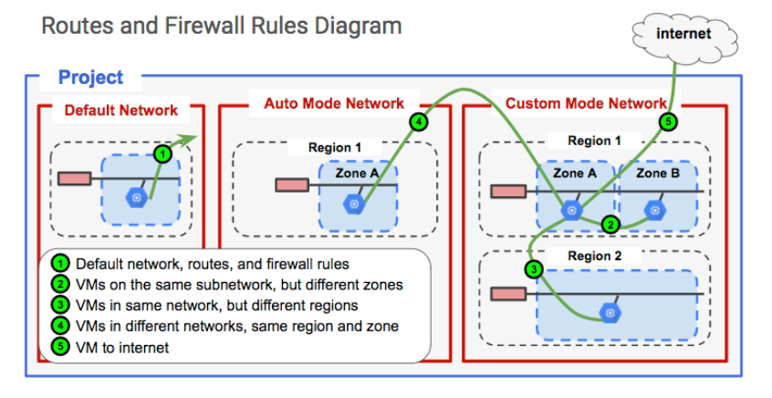
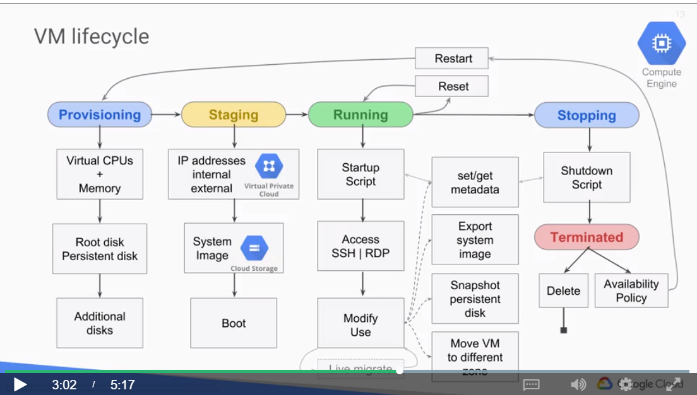
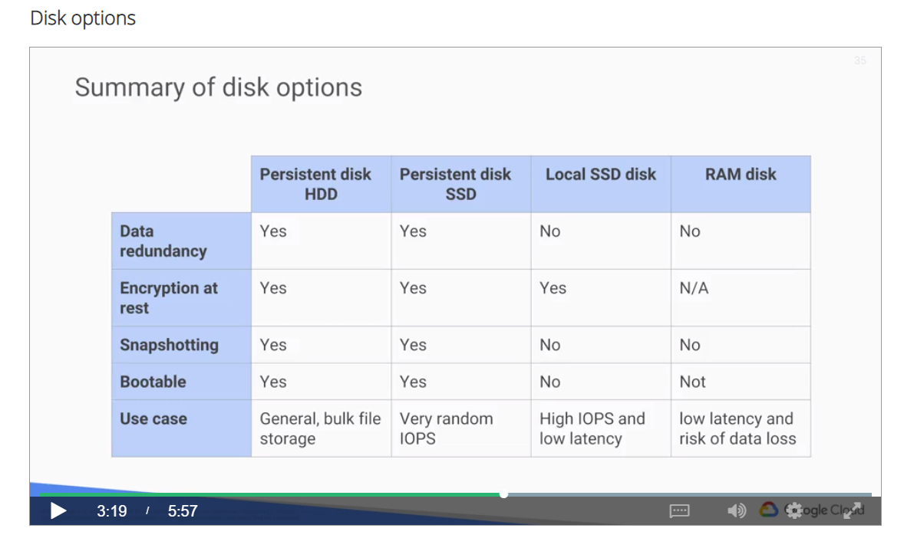

## GCP encompenses 3 core features

- Infrastructure
- Platform
- Software

## Append environment variables to the config file

```bash
echo INFRACLASS_REGION=$INFRACLASS_REGION >> ~/infraclass/config
```

```bash
echo INFRACLASS_PROJECT_ID=$INFRACLASS_PROJECT_ID >> ~/infraclass/config
```

```bash
source infraclass/config
echo $INFRACLASS_REGION
echo $INFRACLASS_PROJECT_ID
```

```bash
nano .profile
```

Add

```bash
source infraclass/config
```

## Projects

```bash
gcloud config list
```

```bash
gcloud config list | grep project
gcloud config list project
```

```bash
export PROJEC_1_ID=<ID_1>
export PROJEC_2_ID=<ID_2>
```

```bash
gcloud config set project $PROJECT_1_ID
```

## Jenkins

```bash
sudo /opt/bitnami/ctlscript.sh stop
```

```bash
sudo /opt/bitnami/ctlscript.sh restart
```

## VPC

### VPC Objects

- Projects
- Network
  - (default, auto mode, custom mode)
  - is global and spans all avaible regions
  - Networks don't have IP ranges, so Subnets don't need to fit into an address hierarchy
- Subnetworks
  - 10.0.0.1 => reserved for the router address
  - 10.0.0.255 => reserved for the broadcast address
  - Can be used to manage resources, just like Cloud IAM, labels, tags and managed instance groups
- IP addresses
  - Internal IP & External IP
  - An internal DNS service translates the symbolic name into the Internal IP address
  - DNS is scoped to the network, so it can translate Web URLs and VMs names of hosts of the same network but not hostnames from VMs in a different network
  - There is also an internal FQDN(fully qualified domain name) for an instance. It uses the format **<hostname|instancename>.c.<project_id>.internal**
  - The DNS name always points to the specific instance no matter if the instance has no longer the same internal IP address after being deleted and recreated
  - Each instance has a metadata server which act as a DNS resolver. It handles all DNS queries for local network resources and routes all other queries to Google's public DNS servers for public name resolution
  - Alias IP ranges

```bash
sudo /sbin/ifconfig
```

- Routes and rules

  - Networks have routes that let instances in a network send traffic directly to each other
  - A default route that directs packets to destinations that are outside the network
  - Firewall must also allow the given packet
  - Manually created networks don't have preconfigured firewall rules which allow all instances of the given network to talk to each other
  - A route applies to an instance if the network and instance stacks match
  - If the network matches and there are no instance tags specified, the route applies to all instances in that network
  - Firewall rules protect VM instances from unapproved connections
  - Firewall rules are applied to the network as a whole
  - But **connections** are **allowed** or **denied** at the instance level
  - If all firewall rules are deleted for some reason => implies deny all ingress rule & allow all egress rule for the network
  - A firewall rule is composed of the following parameters
    - Direction (ingress or egress)
    - Source or Destination (source for ingress: IP addresses, source tags or a source service account) and (destination for egress: ranges of IP addresses)
    - Protocol and Port: can be restricted for specific protocols only or combinations of protocols and ports only
    - Action: allow or deny packets that match the _direction_, _protocol_, _port_ and _source_ or _destination_ of the rule
    - Priority: governs the order in which rules are evaluated: the first matching rule is applied
    - Rule assignments: All rules are assigned to all instances by default, but one can assign certain rules to certain instances only
  - Firewall rule case: Egress => allow or deny outbound connections matching
    - Destination CIDR ranges
    - Protocols
    - Ports
  - Firewall rule case: Ingress => allow or deny inbound connections matching
    - Source CIDR ranges
    - Protocols
    - Ports
    - SourceTags on instances (for VM to VM connections only)

- Billing:
  - Ingress: no charge
  - Egress to the same zone: no charge
  - Egress to a different GCP service within the same region: no charge
  - Egress to google products(youtube, maps, drive...): no charge
  - Egress between zones in the same region: 0.01\$ per GB
  - Egress between regions within the US: 0.1\$ per GB
  - Egress between regions, not including traffic between US regions: At internet egress rates

## Lab

### Create the network topology

- Default network automatically created for each GCP project with a subnet in each region

#### Virtual machines diagram


#### Routes and Firewall rules diagram



#### Firewall rules

- SSH traffic (tcp:22)
- icmp traffic, and rdp (tcp:3389) traffic for Windows VMs

```bash
sudo apt-get install traceroute
```

```bash
sudo traceroute google.com -I
```

#### Expand the address range from Cloud Shell

```bash
gcloud compute networks subnets \
expand-ip-range new-useast \
--prefix-length 23 \
--region us-east1
```

### Bastion

#### From the webserver

```bash
sudo apt-get update
```

```bash
sudo apt-get install apache2 -y
```

```bash
echo '<!doctype html><html><body><h1>Hello World!</h1></body></html>' | sudo tee /var/www/html/index.html
```

#### From the bastion

```bash
curl webserver
```

```bash
ssh -a webserver
```

Shut down the bastion host when not using it.

VPN Gateway

## Compute Engine

### Compute

Predefined or Custom Machine types:

- vCPUs(cores) and Memory(RAM)
- Persistent disks(HDD, SSD and Local SSD)
- Networking
- Linux or Windows

* Network throughput scales at 2Gb per vCPU
* Max throughput at 16Gb or 8vCPU

- A vCPU is equal to 1 hyperthreaded core
- 2 vCPU is equal to 1 physical core

### Storage

#### Persistent disks

- Standard, SSD (Solid-State Drive), Local SSD
- Standard and SSD PDs scale in performance for each GB of space allocated
- Rezize disks, migrate instances with no downtime
- Local SSD have higher throughput and lower latency than SSD cause they are attached to the physical hardware

Sustained usage automatic discounts for custom-type, predefined VMs

#### VM lyfecycle



### Lab

- Idempotent: written to handle a second startup properly
- SSH(Secure Shell) vs RDP(Remote Desktop Protocol)

Information about unused and used memory and swap space on the custom VM

```bash
free
```

RAM

```bash
nproc
```

Number of processors

```bash
nproc
```

Details about the CPUs installed on the VM

```bash
lscpu
```

Exit

```bash
exit
```

### Compute options

Machine types (4 classes)

- n1-standard-vCPUs (1, 2, 4, 8, 16, 32, 64, 96)
- n1-highmem-vCPUs (2, 4, 8, 16, 32, 64, 96)
- n1-highcpu-vCPUs (2, 4, 8, 16, 32, 64, 96)
- shared core (f1-micro and g1-small)

Memory-optimized machine types

- n1-ultramem-Mem (40, 80, 140)
- n1-megamem-Mem (96)

GPU machines

### Images

- Boot disks can survive VM termination or deletion if "Delete book disk when instance is deleted" is disabled

Persistent disks:

- Network storage appearing as a block device

  - can survive VM terminate
  - attached to a VM through the network interface
  - cannot be moved between zones
  - bootable: you can attach a VM and boot from it
  - snapshots: incremental backups

- Features
  - HDD(magnetic) or SSD(faster, solid-state) options
  - disk resizing: even running and attached
  - can be attached in readonly mode to multiple VMs (share static data between multiples instances which is cheaper than replicating data to unique disks for individual instances)

Local SSD disks:

- Physically attached to a VM
- more IOPS, lower latency, higher throughput than persitant disk
- data survives a reset, but not a VM stop or terminate
- VM-specific: cannot be reattached to a different VM

RAM disk

- tmpfs
- Faster than local disk, slower than memory
- user when the application expects a file system structure and cannot directly store its data in memory
- very volatile - erase on stop or restart
- may need higher machine type (highmem ...)
- consider using persistent disk to backup RAM disk data

Summary of disk options


### Limits on persistent disk that can be attached to a VM

| Number of cores | Disk number limit |
| --------------- | ----------------- |
| Sharecore       | 16                |
| 1 core          | 32                |
| 2 - 4 cores     | 64                |
| 8 or more cores | 128               |

### Common actions

- Moving an instance to a new zone within region:

```bash
gcloud compute instances move
```

- Moving an instance between regions:
  Manual process

Snapshots are used in Persistent Disks for:

- backups
- transfer data between zones
- transfer to different disk type
- Snapshot is not avaiable for local SSD
- Snapshots can be restored to a new persistent disk

Snapshot disk preparation

- Boot disk, halt the system

```bash
sudo shutdown -h now
```

- Additional disk, unmount the filesystem

```bash
sudo unmount </mount/point>
```

If unmount isn't possible

- Stop applications from writing to the persitent disk
- Complete pending writes and flush cache

```bash
 sudo sync
```

- Suspend writing to the disk device

```bash
 sudo fsfreeze -f </mount/point>
```

Resize persistent disks

- Persistent disks can be resize without needing a snapshot
- Can be resized even when it is attached to a VM and while it is running
- You can grow disks, but never shrink them

### Working with virtual machines

#### SSH

```bash
sudo mkdir -p /home/minecraft
```

#### Format the disk

```bash
sudo mkfs.ext4 -F -E lazy_itable_init=0,\
lazy_journal_init=0,discard \
/dev/disk/by-id/google-minecraft-disk
```

#### Mount the disk

```bash
sudo mount -o discard,defaults /dev/disk/by-id/google-minecraft-disk /home/minecraft
```

#### Install and run the application

```bash
sudo apt-get update
```

#### Install the headless JRE

```bash
sudo apt-get install -y default-jre-headless
```

#### Download the Minecraft server JAR file (1.11.2 JAR)

```bash
cd /home/minecraft
```

```bash
sudo wget https://s3.amazonaws.com/Minecraft.Download/versions/1.11.2/minecraft_server.1.11.2.jar
```

#### Initialize the Minecraft server

```bash
sudo java -Xms1G -Xmx7G -d64 -jar minecraft_server.1.11.2.jar nogui
```

```bash
sudo ls -l
```

```bash
sudo nano eula.txt
```

#### Create a virtual terminal screen to start the Minecraft server

```bash
sudo apt-get install -y screen
```

#### Start the Minecraft server in a screen virtual terminal (Use the -S flag to name the terminal mcs)

```bash
sudo screen -S mcs java -Xms1G -Xmx7G -d64 -jar /home/minecraft/minecraft_server.1.11.2.jar nogui
```

#### To detach the screen terminal (The terminal continues to run in the background)

```bash
 Ctrl+A, D
```

#### To reattach the terminal

```bash
sudo screen -r mcs
```

#### To exit the ssh terminal

```bash
exit
```

#### Create firewall rule (minecraft-rule) to allow traffic to port 25565(Minecraft default server) with target tag minecraft-server

#### Schedule regular backups

#### Create a Cloud Storage bucket

```bash
export YOUR_BUCKET_NAME=<Enter your bucket name here>
```

```bash
gsutil mb gs://$YOUR_BUCKET_NAME-minecraft-backup
```

#### Create a backup script

```bash
cd /home/minecraft
```

```bash
sudo nano /home/minecraft/backup.sh
```

backup.sh

```bash
#!/bin/bash
screen -r mcs -X stuff '/save-all\n/save-off\n'
/usr/bin/gsutil cp -R ${BASH_SOURCE%/*}/world gs://${YOUR_BUCKET_NAME}-minecraft-backup/$(date "+%Y%m%d-%H%M%S")-world
screen -r mcs -X stuff '/save-on\n'
```

#### Make sure the script is executable

```bash
sudo chmod 755 /home/minecraft/backup.sh
```

#### Test the backup script

```bash
. /home/minecraft/backup.sh
```

#### Schedule a cron job to automate the task

##### Open the cron table for editing

```bash
sudo crontab -e
```

##### At the bottom of the cron table, paste the following line; that line instructs cron to run backups every 4 hours:

```bash
0 */4 * * * /home/minecraft/backup.sh
```

#### Server maintenance

##### Connect via SSH to the server, stop it, and shut down the VM

```bash
sudo screen -r -X stuff '/stop\n'
```

#### Go to the console and stop the VM

#### Automate server maintenance with startup and shutdown scripts

##### Edit VM, for Custom Metadata add key/value

- Key: `startup-script`
- Value:

```bash
#!/bin/bash
mount /dev/disk/by-id/google-minecraft-disk /home/minecraft
(crontab -l ; echo "0 */4 * * * /home/minecraft/backup.sh")| crontab -
cd /home/minecraft
screen -d -m -S mcs java -Xms1G -Xmx7G -d64 -jar minecraft_server.1.11.2.jar nogui
```

- Key: `shutdown-script`
- Value:

```bash
#!/bin/bash
sudo screen -r -X stuff '/stop\n'
```
